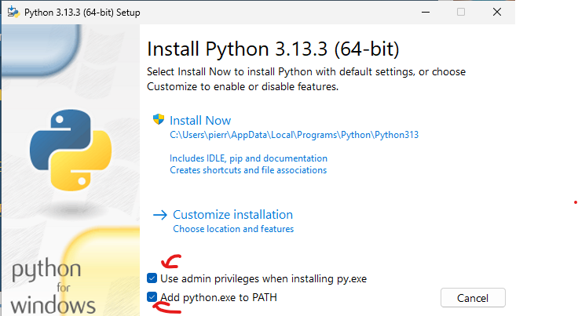

# This is a demo repo to show a bug in the VSCode CMake Tools extension

## Getting Started (Currently Windows Only)

1. Make sure you have [Python](https://www.python.org/downloads/) installed. When doing so make sure that you check the box asking about adding Python to your path.  
   
2. Run the following command `pip3 install -U west` in your choosing of PowerShell or Command Prompt
3. Make sure you have the [arm toolchain](https://developer.arm.com/downloads/-/arm-gnu-toolchain-downloads) installed. Choose `arm-gnu-toolchain-14.2.rel1-mingw-w64-i686-arm-none-eabi.exe`
4. Make sure you have CMake and other C utilities installed via [MSYS2](https://www.msys2.org/)
5. Once MSYS2 is installed, enter the following command into the MSYS2 terminal:  
   `pacman -S mingw-w64-x86_64-cmake mingw-w64-x86_64-ninja mingw-w64-x86_64-toolchain`
6. Add the following environment variable to PATH: `C:\msys64\mingw64\bin`
7. To clone the repo properly make sure to clone it with the `--recurse-submodules` parameter
8. Make sure you have the recommended VSCode extensions installed
